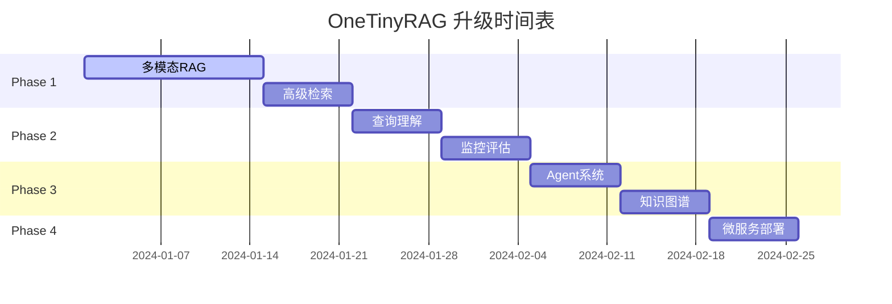

# OneTinyRAG

<div align="center">


**轻量级、可插拔的检索增强生成（RAG）框架**

支持 BM25+Dense 混合检索 | FAISS 向量索引 | 多格式文档处理 | FastAPI 服务化

</div>

## ✨ 特性

- 🔍 **混合检索**: BM25 关键词检索 + Dense 语义检索，支持多种融合策略
- 📚 **多格式支持**: PDF、TXT、JSON 文档解析与处理
- 🧩 **可插拔架构**: 配置驱动的组件化设计，易于扩展
- ⚡ **高性能**: FAISS 向量索引，支持批量处理与并发
- 🌐 **服务化**: FastAPI RESTful API，支持流式输出
- 🤖 **多模型**: 支持 DeepSeek API 和本地 Ollama 部署
- 🔧 **智能分块**: 递归、Token、语义、元数据多种分块策略
- 📊 **任务编排**: 基于依赖图的智能工作流调度

## 🚀 快速开始

### 环境要求

- Python 3.8+
- 8GB+ RAM (推荐)
- GPU (可选，用于本地模型推理)

### 安装

```bash
# 克隆项目
git clone https://github.com/ZeXi0308/tiny_RAG.git
cd tiny_RAG

# 安装依赖
pip install -r requirements.txt

# 或使用一键启动脚本
chmod +x start.sh
./start.sh
```

### 基础使用

#### 1. 命令行模式

```bash
# 使用默认配置运行
python OneTinyRAG/app.py

# 使用混合检索配置
python OneTinyRAG/app.py --config OneTinyRAG/Config/config_hybrid.json
```

#### 2. API 服务模式

```bash
# 启动 FastAPI 服务
python api_server.py

# 测试 API
curl -X POST "http://localhost:8000/query" \
  -H "Content-Type: application/json" \
  -d '{"query": "什么是检索增强生成？", "config_name": "config_hybrid"}'
```

#### 3. Python 集成

```python
from OneTinyRAG.Indexer.Indexer import Indexer
from OneTinyRAG.Retriever.Retriever import Retriever
from OneTinyRAG.Generator.Generator import Generator

# 初始化组件
config = {...}  # 加载配置
indexer = Indexer(config)
retriever = Retriever(config)
generator = Generator(config)

# 构建索引
embedder, index, documents = indexer.index("path/to/documents")

# 检索相关文档
results = retriever.retrieval(query="用户问题", embedder=embedder, index=index)

# 生成回答
answer = generator.generate(query="用户问题", retrieved_docs=results)
```

## 📁 项目结构

```
OneTinyRAG/
├── Indexer/           # 文档处理与索引构建
│   ├── DataProcessor.py    # PDF/TXT/JSON 解析器
│   ├── Chunker.py          # 多种分块策略
│   ├── Embedder.py         # 向量化与 FAISS 索引
│   └── Indexer.py          # 索引构建门面类
├── Retriever/         # 检索模块
│   ├── Retrieval.py        # 基础检索器
│   ├── HybridRetriever.py  # BM25+Dense 混合检索
│   └── Retriever.py        # 检索器统一接口
├── Generator/         # 生成模块
│   ├── Generator.py        # 生成器接口
│   └── Generate.py         # DeepSeek/Ollama 实现
├── Tools/             # 查询优化与工作流
│   ├── Query.py            # 查询结构化
│   ├── Workflow.py         # 任务图调度
│   └── Utils.py            # 工具函数
├── Config/            # 配置文件
├── Dataset/           # 示例数据
└── app.py            # 主程序入口
```

## 🗺️ 发展路线图

OneTinyRAG 正在积极开发中，计划通过以下阶段将其升级为企业级智能文档助手平台：

### Phase 1: 核心AI能力增强 (Week 1-3) 🔥
- **多模态RAG系统**
  - 📷 图像OCR文本提取 (PaddleOCR)
  - 🖼️ 图文跨模态检索 (CLIP)
  - 📊 表格结构化解析
  - 🔗 跨模态语义理解

- **高级检索策略**
  - 🎯 两阶段检索 + 重排序 (BGE-Reranker)
  - 🧠 假设文档嵌入 (HyDE)
  - 📈 自适应检索策略
  - 🔄 多种融合算法

### Phase 2: 生产级工程能力 (Week 4-5) ⚡
- **查询理解系统**
  - 🎭 意图分类与实体识别
  - 📝 查询扩展与重写
  - 🧩 上下文管理
  - 🔍 语义搜索优化

- **系统监控与评估**
  - 📊 Prometheus + Grafana 监控面板
  - 🧪 自动化质量评估 (RAGAS)
  - 📈 性能指标追踪
  - 🚨 智能告警系统

### Phase 3: 前沿AI技术 (Week 6-7) 🤖
- **Agent智能体系统**
  - 🧠 ReAct推理框架
  - 🛠️ 工具调用能力
  - 🔗 多智能体协作
  - 🎯 复杂任务分解

- **知识图谱集成**
  - 🕸️ 实体关系抽取
  - 📊 图谱构建与检索
  - 🔍 多跳推理能力
  - 💡 知识发现

### Phase 4: 云原生部署 (Week 8) ☁️
- **微服务架构**
  - 🐳 Docker容器化
  - 🎛️ Kubernetes编排
  - 🔄 负载均衡与扩缩容
  - 📦 Helm Chart部署

### 技术栈升级计划

| 组件 | 当前版本 | 目标版本 | 主要改进 |
|------|----------|----------|----------|
| **检索引擎** | FAISS + BM25 | Multi-Modal + Graph | 跨模态检索 + 图谱推理 |
| **AI模型** | BGE + DeepSeek | CLIP + Agent + LLM | 多模态理解 + 智能推理 |
| **服务架构** | 单体FastAPI | 微服务 + K8s | 高可用 + 弹性扩展 |
| **监控体系** | 基础日志 | Prometheus + Grafana | 全链路可观测性 |
| **评估框架** | 手工测试 | 自动化RAGAS | 持续质量保证 |

### 里程碑时间表



> 🎯 **目标**: 8周内完成从基础RAG到企业级智能助手的全面升级，打造简历亮点项目

## ⚙️ 配置说明

### 基础配置 (config7.json)

```json
{
  "chunker": {
    "type": "MetaDataChunker",
    "params": {
      "chunk_size": 128,
      "language": "chinese"
    }
  },
  "embedder": {
    "type": "MetaDataEmbedder",
    "params": {
      "model_name": "BAAI/bge-small-zh-v1.5"
    }
  },
  "retriever": {
    "type": "CosinRetriever",
    "params": {
      "top_k": 5
    }
  },
  "generator": {
    "type": "DeepSeekGenerator",
    "params": {
      "api_key": "your_api_key"
    }
  }
}
```

### 混合检索配置 (config_hybrid.json)

```json
{
  "retriever": {
    "type": "HybridRetriever",
    "params": {
      "top_k": 10,
      "bm25_weight": 0.3,
      "dense_weight": 0.7,
      "language": "chinese",
      "fusion_method": "weighted_sum",
      "normalization_method": "min_max"
    }
  }
}
```

## 🔧 核心功能

### 1. 混合检索策略

- **BM25 检索**: 基于词频的关键词匹配
- **Dense 检索**: 基于语义向量的相似度检索
- **融合方法**: 加权求和、调和平均、几何平均、RRF 等
- **归一化**: Min-Max、Z-score、Rank 标准化

### 2. 智能分块策略

- **RecursiveChunker**: 递归字符分割
- **TokenChunker**: 基于 Token 数量分割
- **SemanticChunker**: 基于 spaCy/NLTK 的语义分割
- **MetaDataChunker**: 保留元数据的滑窗分块

### 3. 多格式文档处理

- **PDF**: 提取文本内容和元数据
- **TXT**: 智能文本清洗和格式化
- **JSON**: 学术论文格式特化处理

### 4. 任务编排系统

- **依赖分析**: 自动构建任务依赖图
- **并发执行**: 基于 asyncio 的高效调度
- **容错处理**: 优雅降级和错误恢复

## 📊 API 文档

### 核心端点

| 端点 | 方法 | 描述 |
|------|------|------|
| `/query` | POST | 标准查询接口 |
| `/stream` | POST | 流式输出接口 |
| `/health` | GET | 健康检查 |
| `/configs` | GET | 获取可用配置 |

### 查询示例

```bash
# 标准查询
curl -X POST "http://localhost:8000/query" \
  -H "Content-Type: application/json" \
  -d '{
    "query": "RAG 系统如何工作？",
    "config_name": "config_hybrid",
    "top_k": 5
  }'

# 流式查询
curl -X POST "http://localhost:8000/stream" \
  -H "Content-Type: application/json" \
  -d '{
    "query": "解释检索增强生成",
    "config_name": "config7"
  }'
```

## 🐳 Docker 部署

```bash
# 构建镜像
docker build -t onetinyrag:latest .

# 运行容器
docker run -p 8000:8000 -v $(pwd)/OneTinyRAG/Dataset:/app/OneTinyRAG/Dataset onetinyrag:latest

# 使用 Docker Compose
docker-compose up -d
```

## 🧪 测试与评估

```bash
# 运行混合检索测试
python test_hybrid_retrieval.py

# 运行完整演示
python demo.py
```

## 🛠️ 开发指南

### 添加新的检索器

1. 在 `Retriever/` 目录下创建新的检索器类
2. 继承基础接口并实现 `retrieval_txt` 方法
3. 在 `Mappers/Mappers.py` 中注册新检索器
4. 更新配置文件支持新参数

### 添加新的分块策略

1. 在 `Indexer/Chunker.py` 中实现新的分块类
2. 继承 `BaseChunker` 并实现 `chunk_text` 方法
3. 在映射器中注册新分块器

## 📈 性能优化

- **批量处理**: 支持文档批量嵌入
- **索引持久化**: FAISS 索引保存与加载
- **内存优化**: 大文档流式处理
- **并发控制**: 可配置的线程池大小

## 📊 项目状态

### 当前版本: v1.0.0
- ✅ 基础RAG框架
- ✅ 混合检索系统 
- ✅ FastAPI服务化
- ✅ Docker部署支持
- 🚧 多模态RAG (开发中)
- 📋 Agent系统 (计划中)
- 📋 监控评估 (计划中)

### 技术债务与改进点
- [ ] 增加单元测试覆盖率 (目标: >80%)
- [ ] 优化内存使用效率
- [ ] 添加API文档 (OpenAPI/Swagger)
- [ ] 实现配置热重载
- [ ] 增加错误处理和重试机制

## 🤝 贡献指南

### 如何参与开发
1. **Fork 项目** 到您的GitHub账户
2. **克隆仓库** `git clone https://github.com/ZeXi0308/tiny_RAG.git`
3. **创建特性分支** `git checkout -b feature/amazing-feature`
4. **本地开发** 并确保通过所有测试
5. **提交更改** `git commit -m 'feat: add amazing feature'`
6. **推送分支** `git push origin feature/amazing-feature`
7. **创建 Pull Request** 并详细描述您的更改

### 开发规范
- **代码风格**: 遵循 PEP 8 规范
- **提交信息**: 使用 [Conventional Commits](https://www.conventionalcommits.org/) 格式
- **测试要求**: 新功能必须包含相应的单元测试
- **文档更新**: 重要更改需要更新 README 和代码注释

### 优先贡献领域
1. 🔥 **多模态功能** - 图像处理、跨模态检索
2. 🤖 **Agent系统** - 推理能力、工具集成  
3. 📊 **监控评估** - 指标收集、质量评估
4. 🧪 **测试完善** - 单元测试、集成测试
5. 📚 **文档优化** - 使用示例、API文档

## 📝 许可证

本项目采用 MIT 许可证 - 查看 [LICENSE](LICENSE) 文件了解详情。

## 🙏 致谢

- [FAISS](https://github.com/facebookresearch/faiss) - 高效向量检索
- [Sentence Transformers](https://github.com/UKPLab/sentence-transformers) - 语义嵌入
- [rank-bm25](https://github.com/dorianbrown/rank_bm25) - BM25 实现
- [FastAPI](https://github.com/tiangolo/fastapi) - 现代 Web 框架
- [LangChain](https://github.com/langchain-ai/langchain) - LLM 应用框架

## 📞 联系方式

- 作者: 赵振宇
- 邮箱: zhenyu.zhao@mail.polimi.it
- 项目链接: [https://github.com/ZeXi0308/tiny_RAG](https://github.com/ZeXi0308/tiny_RAG)

---

<div align="center">

**⭐ 如果这个项目对你有帮助，请给个 Star！⭐**

</div>
